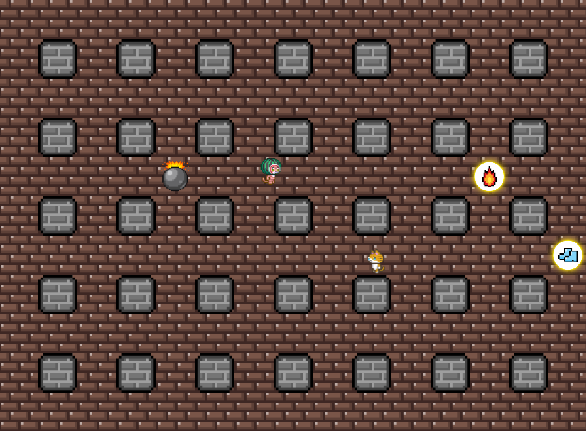

# AIを使用した2Dアクションゲーム

## 概要

本ゲームは、爆弾を設置して敵を倒し、最後まで生き残ることを目的とした、シンプルかつ直感的なルールの2Dアクションゲームです。

- **開発言語**：Visual C++
- **描画ライブラリ**：DxLib

## ゲームの特徴

- 爆弾を設置して敵を撃破する、戦略性のあるシンプルなゲームルール
- CPUは学習済みAIを搭載。周囲の状況に応じて、最適な行動をするように学習済み。

## 機械学習へのこだわり

学習モデルには自作の**深層強化学習モデル**を使用しています

- 機械学習モジュール（PyTorchなど）使用せず、C++でスクラッチ実装
- 学習モデルには深層強化学習の１種であるDQN（Deep-Q-Network)を使用（詳しいネットワーク構造や報酬設計などについては、今後記述する予定）

## 動作環境

- Windows環境
- Visual Studio 2022

## 今後の展望

- ファイル・コードの整理、UIの改善（AIの実装に手間をかけ過ぎて、色々散らかってます）
- 複数ステージの追加
- 学習モデルの改善（報酬設計の見直しなど）

---

